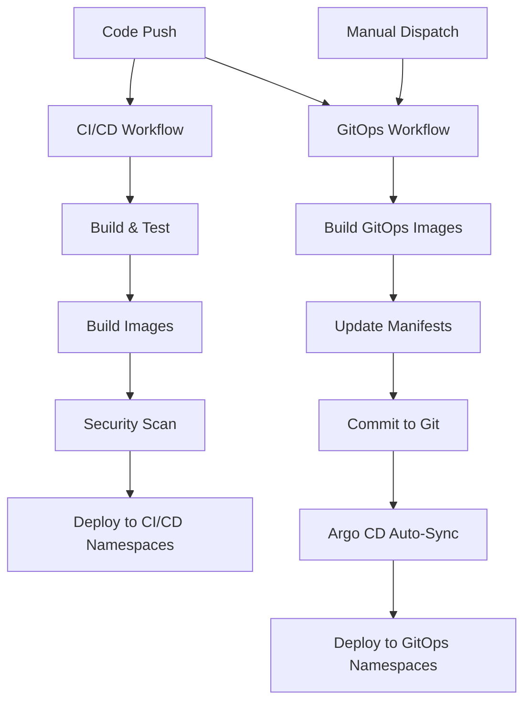

# GitHub Actions Workflow Separation

This document explains the separation of GitHub Actions workflows for the Farmers Bank Microservices project.

## Overview

The deployment process has been separated into two distinct workflows to improve maintainability and separation of concerns:

### 1. CI/CD Workflow (Push-based) - `ci-cd.yml`

**Purpose**: Traditional CI/CD pipeline for immediate deployments  
**Trigger**: Push to main/develop, Pull Requests, Manual dispatch  
**Target Namespaces**: `memberservices-cicd`, `loansunderwriting-cicd`, etc.  

**Jobs**:
- ✅ **build-and-test**: Code compilation, unit tests, quality checks
- ✅ **build-images**: Docker image building and pushing to ACR
- ✅ **security-scan**: Container security scanning with Trivy
- ✅ **deploy-dev**: Direct deployment to AKS dev environment (CI/CD namespace)
- ✅ **deploy-staging**: Direct deployment to AKS staging environment (CI/CD namespace)
- ✅ **notify-deployment**: Slack/Teams notifications

**Characteristics**:
- Immediate deployment after successful build
- Uses kubectl for direct Kubernetes deployments
- Separate namespaces from GitOps deployments
- Fast feedback loop for development

### 2. GitOps Build & Update Workflow - `gitops-update.yml`

**Purpose**: Complete GitOps pipeline - builds images and updates manifests for Argo CD  
**Trigger**: Push to main (src/** or gitops/** changes), Manual dispatch  
**Target Namespaces**: `memberservices-gitops`, `loansunderwriting-gitops`, etc.  

**Jobs**:
- ✅ **build-and-push-images**: Builds container images with unique GitOps tags
- ✅ **update-gitops-manifests**: Updates Git manifests with new image tags  
- ✅ **notify-argocd-sync**: Status reporting and Argo CD sync notification

**Characteristics**:
- Self-contained pipeline (builds its own images)
- Unique tagging: `gitops-{shortsha}-{timestamp}` 
- Updates Git repository manifest files automatically
- Argo CD automatically syncs changes
- Declarative and auditable deployments
- Manual environment targeting (dev/staging)

## Workflow Interaction

## Benefits of Separation

### 🚀 **Improved Performance**
- CI/CD workflow runs faster without Git operations
- GitOps updates run independently and asynchronously
- Parallel execution of different deployment strategies

### 🔧 **Better Maintainability** 
- Clear separation between immediate deployments and GitOps
- Easier to troubleshoot specific workflow failures
- Independent versioning and updates

### 🛡️ **Enhanced Security**
- CI/CD workflow only needs read permissions
- GitOps workflow has minimal write permissions
- Reduced permission scope for each workflow

### 📊 **Deployment Strategy Flexibility**
- Test features in CI/CD namespaces first
- Promote to GitOps namespaces after validation
- Different rollback strategies for each approach

## Namespace Strategy

| Environment | CI/CD Namespace | GitOps Namespace | Purpose |
|-------------|----------------|------------------|---------|
| Development | `memberservices-cicd` | `memberservices-gitops` | Fast iteration vs Stable deployments |
| Staging | `staging-cicd` | `staging-gitops` | Pre-prod testing vs Release candidates |
| Production | `prod-cicd` | `prod-gitops` | Hotfixes vs Regular releases |

## Monitoring & Observability

Both workflows maintain comprehensive logging and can be monitored through:

- **GitHub Actions**: Workflow run history and logs
- **Azure Monitor**: Application and infrastructure metrics
- **Argo CD Dashboard**: GitOps deployment status
- **Kubernetes Dashboard**: Pod and service health
- **Application Insights**: Application performance monitoring

## Troubleshooting

### CI/CD Workflow Issues
1. Check build and test logs
2. Verify Azure credentials and ACR access
3. Check AKS cluster connectivity
4. Review namespace configurations

### GitOps Workflow Issues  
1. Verify GitHub token permissions
2. Check Argo CD application sync status
3. Review manifest file changes in Git history
4. Validate Argo CD webhook configuration

## Next Steps

1. **Monitor both workflows** for successful operation
2. **Configure Argo CD applications** for all microservices
3. **Set up alerts** for workflow failures
4. **Implement promotion workflows** between namespaces
5. **Add integration tests** between CI/CD and GitOps deployments

This separation provides a robust, scalable deployment strategy that supports both rapid development iterations and stable production deployments.